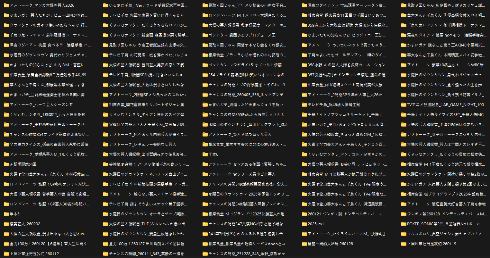
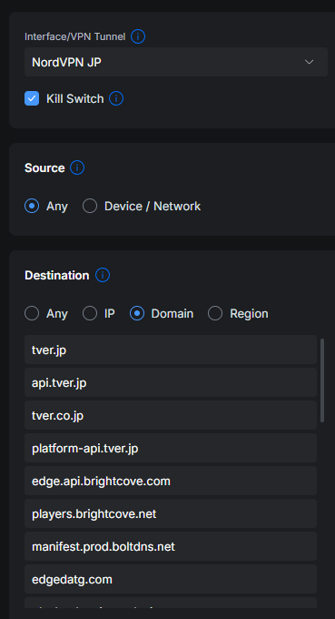

> 本來發表在 bilibili，審核未通過 :>

# 目的

煮飯還是叫外送前，可以看一下什麼生肉沒看過，打個指令過幾分鐘就能在電視或 iPad 上配飯看。

所以很講求一次性自動化的翻譯品質。

# 緣由

年初 2025 M1 熟肉苦等不到，想說 AI 翻譯現在也算在價格與能力的甜蜜點，就試著做了個自動化，感覺大概可以做到 70 ~ 80 分左右的品質。

使用到目前三個月，覺得差不多沒什麼痛點了，於是分享紀錄一下。



# 流程

簡單來說就四個步驟：**下載**、**語音辨識**、**翻譯(預處理)**、**翻譯(批次)**。

## 下載與資訊擷取

YT-DLP 配上科學上網



另外，tver 跟 abema 可以從 API 拿到節目資訊以及出演人員，尤其出演人員很關鍵，會有名稱、所在組合、節目中的角色等重要訊息。

## 語音辨識

全部用下來覺得最好的是 ElevenLabs 的 `Scribe v2`。

接下來是 豆包語音 的 `音视频字幕生成`，然後 阿里雲 的 `Fun-ASR` (注意不是 `fun-asr-mtl`)。

其他 Google 的 `Chirp 3` 還是 OpenAI 的 `GPT-4o-transcribe `等都是不合格的。而自架方案也都試過了，就算是最新的 `Qwen3-ASR` 都算不上能用。

## 翻譯

模型選擇上，也基本都試過一輪，最後還是 `Google Gemini 3` 翻譯最好，日翻中比英翻中難太多了，尤其很多氛圍意境很難單純從字幕上直接獲取。

網路上大多數都在比 agent 調用、比寫 code、比 tool calling，但日翻中很難從這些角度去評價出來。

### 翻譯(預處理)

這個步驟，會將以下資料餵給 LLM：

1. 語音辨識出來的日文字幕
2. 節目的完整音檔
3. 節目的多個截圖
4. 節目資訊 (下載步驟獲取的節目標題、介紹、出演人員資訊)

先產生出一個節目概要資訊當作絕對事實，之後分段批次翻譯使用，以免出現資訊不同步的狀況。

Gemini 3 在有原本音檔跟圖片輔助下，翻譯的品質我覺得是跨過「你翻的這些我都看得懂，配上畫面我卻看不懂他們在聊什麼」這種常見 AI 翻譯困惑的關鍵。

輸出概要資訊如下：

```json
{
  "summary": "本集《見取圖唷》迎來「小聲女子會」單元第二彈。在現今重視合規、言論受限的時代，邀請多位女星與藝人，以「謙虛的小聲」分享那些平時大聲說不出來、帶點毒舌或偏見的真心話。參與成員包括 Becky、重盛さと美，以及首次參戰的紅生薑組合與 ABEMA 主播瀧山茜。話題從 LINE 的回覆習慣、美容院的社交壓力，一路聊到對 ABEMA 工作的態度、交友軟體照片詐騙，以及利用肢體接觸接近異性的技巧。節目充滿關西搞笑藝人的快節奏吐槽，以及女性嘉賓之間辛辣又真實的經驗分享。",
  "characters": [
    {
      "name_jp": "盛山 晋太郎",
      "name_zh": "盛山晉太郎",
      "role_note": "主持人，搞笑組合「見取圖」成員"
    },
    {
      "name_jp": "リリー",
      "name_zh": "Lily",
      "role_note": "主持人，搞笑組合「見取圖」成員"
    },
    {
      "name_jp": "ベッキー",
      "name_zh": "Becky",
      "role_note": "資深女藝人，與福留關係良好"
    },
    {
      "name_jp": "重盛 さと美",
      "name_zh": "重盛さと美",
      "role_note": "綜藝女星，以腦洞大開的發言著稱"
    },
    {
      "name_jp": "瀧山 あかね",
      "name_zh": "瀧山茜",
      "role_note": "ABEMA 主播，首次參加地上波談話節目"
    },
    {
      "name_jp": "福留 光帆",
      "name_zh": "福留光帆",
      "role_note": "藝人、女演員，前 AKB48 成員"
    },
    {
      "name_jp": "稲田 美紀",
      "name_zh": "稲田美紀",
      "role_note": "搞笑組合「紅生薑」成員"
    },
    {
      "name_jp": "熊元 プロレス",
      "name_zh": "熊元摔角",
      "role_note": "搞笑組合「紅生薑」成員"
    },
    {
      "name_jp": "りなぴっぴ",
      "name_zh": "Rinapippi",
      "role_note": "搞笑組合「Linda Color ∞」成員"
    }
  ],
  "proper_nouns": {
    "見取り図": "見取圖",
    "アベマ": "ABEMA",
    "競輪": "競輪（自行車賽）",
    "カルバン・クライン": "Calvin Klein",
    "地上波": "無線電視（地上波）",
    "リアクション機能": "貼圖回應功能",
    "藤本さん": "藤本敏史",
    "びちゃびちゃ論": "濕漉漉討論（前次節目單元名稱）",
    "竹山": "瀧山",
    "稲見": "稲田",
    "矢久間プロ": "熊元摔角"
  },
  "glossary": {
    "小声女子会": "小聲女子會",
    "コンプライアンス": "合規性/順應社會規範",
    "ボディタッチ": "肢體接觸",
    "合コン": "聯誼",
    "ボケ": "裝傻",
    "ツッコミ": "吐槽",
    "官僚合コン": "官僚聯誼",
    "お笑いタレント": "搞笑藝人",
    "源氏名": "藝名/花名"
  },
  "catchphrases": [
    {
      "phrase_jp": "大きい声では言えないけど小さい声なら言える",
      "phrase_zh": "大聲說不出來，但小聲就能說出口",
      "note": "單元開場白，強調發言僅代表個人微小意見"
    },
    {
      "phrase_jp": "炊き込みご飯",
      "phrase_zh": "什錦炊飯",
      "note": "熊元摔角在模擬肢體接觸技巧時，自創的奇怪「掉東西」梗"
    }
  ],
  "tone_notes": "節目語調輕快且毒舌，嘉賓在「小聲」的前提下會發表較具爭議的言論。見取圖兩位主持人的吐槽犀利，與女性嘉賓之間存在微妙的攻防。翻譯時應注意區分關西腔的爽快感，並保持瀧山主播與藝人之間語氣的差異（瀧山語氣較為專業但內容大膽）。",
  "segment_summaries": [
    {
      "from_index": 1,
      "to_index": 112,
      "summary": "開場介紹嘉賓，提到 Becky 與福留因節目結緣私下會約喝酒。福留分享對於 LINE「貼圖回應功能」的不滿，認為經紀人或後輩只點愛心而不回文字，會讓認真寫內容的人感到被敷衍，並引發關於「自己也常這樣敷衍別人」的自嘲。"
    },
    {
      "from_index": 113,
      "to_index": 218,
      "summary": "討論 LINE 功能的「時效性」，以及 LINE 慶生提醒帶來的社交壓力。Becky 分享去美容院或做 SPA 時，被要求給評語會感到壓力巨大。紅生薑的稲田則吐槽美容院結束後的下午茶與餅乾是「不吃完不能走」的強制任務。"
    },
    {
      "from_index": 219,
      "to_index": 330,
      "summary": "話題轉向在美容院是否敢說實話。熊元摔角分享自己去男公關店的經驗，會故意讚美別的公關來讓中意的對象吃醋。瀧山主播大膽開砲，認為許多藝人（如藤本敏史）錄 ABEMA 節目時態度隨便、鬍子不刮、甚至開演前 30 秒才進場，覺得 ABEMA 被輕視。"
    },
    {
      "from_index": 331,
      "to_index": 442,
      "summary": "重盛表示對市面上過度標榜「生（現做/生食感）」的甜點感到反感與恐懼。稲田分享交友軟體上的照片詐騙，指出男性詐騙其實比女性更嚴重，常放一些遠景或氛圍照片。最後討論到大家私下的聯誼經驗，成員們清一色是搞笑藝人。"
    },
    {
      "from_index": 443,
      "to_index": 554,
      "summary": "熊元摔角分享最強肢體接觸是「搭肩膀」，因為這能以友情名義行親密之實。瀧山主播則傳授「醉後裝跌倒」撞向異性的技巧。熊元摔角現場模仿瀧山的招式，卻自創了「掉落什錦炊飯」的荒謬橋段，讓主持人吐槽連連。"
    }
  ]
}
```

### 翻譯(批次)

接下來會採取分段同時翻譯，通常是以 6000字 (約五分鐘) 一段。

為什麼會採取分段？主要有兩個優點：

1. 速度，多段平行翻譯，速度當然也比較快。
2. 品質，減少上下文的 Token，會大幅增加翻譯品質，LLM 的思考 token 也能完全專注在這五分鐘發生什麼。格式或時間軸錯誤也會減少。

但也因此，需要先預處理的概要資訊去維繫各段翻譯的一致性。

最早有使用 `Gemini 3 Pro` 直接一次全部翻譯，但結構錯誤機率高，大概到二十分鐘後時間軸就有可能出現偏移。

這步驟餵給 LLM 的資料：

1. 該段的切割音檔
2. 該段的多個圖檔 (每 30 秒一張)
3. 預處理的概要資訊
4. 該段的日文字幕

# 總結

目前流程處理一個小時的節目大概是 20 元台幣，耗時 10 ~ 15 分鐘左右。

不過其實瑕疵還是很多，譬如：

1. 特殊事件或專有名詞，沒辦法另外在頂部加註釋。
2. 大喜利的翻譯品質。
3. 需要對電波的漫才翻譯品質。
4. 有時候甚至會自作聰明做修正，像某段在討論 M1 冠軍，直接把 Takuro 改翻成 令和浪漫。